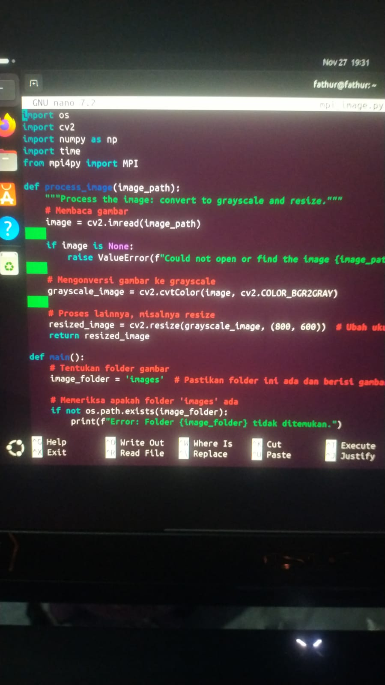
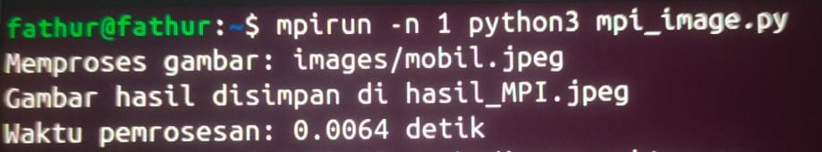
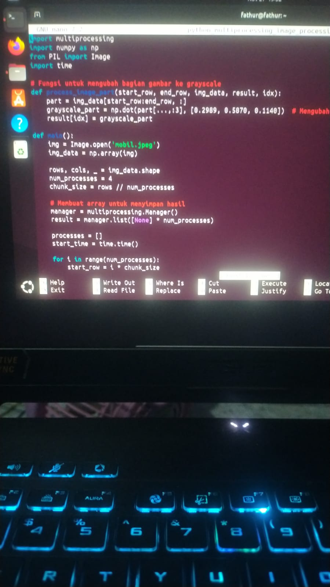

NAMA  : Fathur Rahman  
KELAS : TK3C  
NIM   : 09030282327047  

# PERBANDINGAN DALAM MENGEDIT SEBUAH GAMBAR MENJADI GRAYSCALE DALAM MENGGUNAKAN MPI LINUX DAN PYHTON LINUX  

### MPI(Message Passing Interface)
###### Dalam menjalankan program berbasis MPI (Message Passing Interface), terdapat berbagai kompilator yang perlu diinstal secara terpisah untuk memastikan kompatibilitas dan kinerja yang optimal. Proses ini mencakup pengunduhan dan instalasi beberapa komponen penting, seperti kompilator C/C++ dan Fortran, serta pustaka MPI yang sesuai, seperti Open MPI atau MPICH. Selain itu, setiap kompilator harus dikonfigurasi dengan benar agar dapat mendukung komunikasi antar-proses dalam lingkungan komputasi paralel. Langkah-langkah ini memerlukan perhatian khusus untuk memastikan semua alat bekerja secara harmonis, sehingga program MPI dapat berjalan dengan efisien di berbagai platform.

### Cara Menggunakan MPI Pada Terminal Linux
##### Langkah 1: Buka terminal linux
##### Langkah 2: Perbarui Paket Sistem dengan menjalankan ( sudo apt update && sudo apt upgrade -y )
##### Langkah 3: Instal Kompilator C/C++ dan Fortran dengan menjalankan ( sudo apt install build-essential gfortran -y )
##### Langkah 4: Pilih Pustaka MPI untuk Instalasi dengan menjalankan ( sudo apt install openmpi-bin libopenmpi-dev -y ) dan ( sudo apt install mpich libmpich-dev -y )
##### Langkah 5: Buat lah program lalu jadikan script dengan menjalankan ( nano mpi_image,py )
###### seperti pada gambar

##### Langkah 6: lalu run program tersebut dengan menjalankan ( mpirun -n 1 pyhton3 mpi_image.py )
###### seperti pada gambar

##### terlihat sangat jelas jika proses berhasil akan mengeluarkan sebuah output yang bertuliskan
###### sebuah gambar yang di simpan di storage lokal dengan durasi pemrosesan 0,0064 detik.
##### dengan hasil gambar sebagai berikut

#
#
### PYTHON Multiprocessing
###### Python Multiprocessing adalah fitur yang memungkinkan Anda untuk menjalankan beberapa proses secara bersamaan (paralel), yang sangat berguna untuk tugas-tugas yang memerlukan banyak komputasi atau I/O, seperti pengolahan gambar. Dengan menggunakan multiprocessing, Anda bisa memanfaatkan beberapa core prosesor di komputer Anda untuk mempercepat proses pengolahan gambar, yang biasanya memerlukan waktu lama jika dilakukan secara serial (satu per satu).

### Cara Menggunakan PYTHON Multiprocessing
##### Langkah 1: Buka terminal linux
##### Langkah 2: Install Pillow (jika belum terpasang)dengan menjalankan ( pip install Pillow )
##### Langkah 3: Buat lah program lalu jadikan script dengan menjalankan ( nano perbandingan_pyhton.py )
###### seperti pada gambar

##### Langkah 4: lalu run program tersebut dengan menjalankan ( pyhton3 perbandingan_pyhton.py )
###### seperti pada gambar

##### terlihat sangat jelas jika proses berhasil akan mengeluarkan sebuah output yang bertuliskan
###### sebuah gambar yang di simpan di storage lokal dengan durasi pemrosesan 0,03 detik.
##### dengan hasil gambar sebagai berikut

#
#

